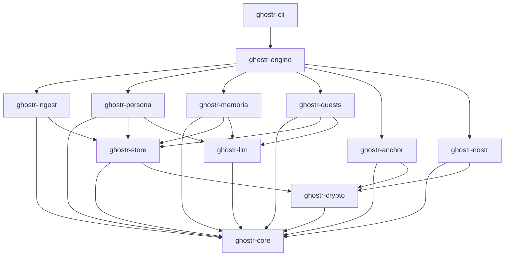
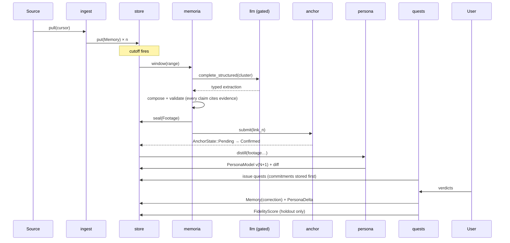

# Ghostr — Architecture

**Status:** Draft v0.1 · scaffolded, unimplemented
**Companion to:** [SPEC.md](SPEC.md) (what it does) and
[THREAT_MODEL.md](THREAT_MODEL.md) (what it defends against)

This document fixes the cargo workspace layout, the dependency direction, what
each crate owns, and the traits that form the seams. It exists so the first
thousand lines of code don't quietly become the wrong shape.

---

## 1. Shaping forces

Five constraints drive every decision below.

| Force | Consequence |
| --- | --- |
| **Privacy is the product** | The egress boundary must be a *place*, not a convention. One crate opens provider connections; everything else asks it to. |
| **Local-first, no server** | No crate assumes a network. Every network-touching crate is optional at the seam. |
| **Immutable, anchored memory** | Hashing and canonical serialization live in a leaf crate with no I/O, so they can't drift with storage changes. |
| **Swappable models** | The LLM is a trait, resolved at the composition root. Nothing else knows a provider exists. |
| **Contributor-friendly** | A newcomer should be able to add an ingest adapter or a model provider without reading the whole tree. Adapters are behind traits with a test kit. |

---

## 2. Workspace layout

```
ghostr/
├── Cargo.toml                  # [workspace], resolver = "3", shared [workspace.dependencies]
├── crates/
│   ├── ghostr-core/            # domain types, canonical CBOR, hashing, Merkle. Zero I/O.
│   ├── ghostr-crypto/          # NIP-06/19/44, secp256k1, keystore, Signer
│   ├── ghostr-store/           # encrypted SQLite, blobs, vector index
│   ├── ghostr-llm/             # LanguageModel/Embedder traits, prompts, EGRESS GATE
│   ├── ghostr-ingest/          # Source trait + adapters (feature-gated)
│   ├── ghostr-persona/         # persona build / merge / diff / retrieval
│   ├── ghostr-memoria/         # the daily compile pipeline
│   ├── ghostr-quests/          # generation, verdicts, scoring, fidelity math
│   ├── ghostr-anchor/          # commitment chain, OpenTimestamps, verification
│   ├── ghostr-nostr/           # relay client, event codec for our kinds
│   ├── ghostr-engine/          # orchestration, scheduling, job queue — the composition root
│   ├── ghostr-cli/             # `gst` binary
│   └── ghostr-testkit/         # fixtures, fake clock/rng/LLM, proptest strategies (dev only)
└── xtask/                      # dev automation (vectors, schema dumps, dep-direction lint)
```

Thirteen crates is more than a project this size strictly needs. The split is
justified where it enforces something a module boundary cannot: `ghostr-core`
being I/O-free is checkable by its dependency list, and `ghostr-llm` being the
only crate that can reach a provider is checkable by the same means. Crates that
exist only for tidiness are not worth their compile time — if a boundary stops
enforcing an invariant, merge it.

---

## 3. Dependency direction

Strictly acyclic. `core` is a leaf, `engine` is the root, nothing depends on
`engine` or `cli`.



### Rules

1. **`ghostr-core` depends on nothing but serde, thiserror, and time/uuid.** No
   tokio, no reqwest, no rusqlite. If core needs I/O, the design is wrong.
2. **No sideways dependencies between the domain crates.** `persona`, `memoria`,
   `quests`, and `ingest` do not import each other. They share types via `core`
   and are composed by `engine`. Memoria produces a `Footage`; persona consumes
   one; neither knows the other exists.
3. **Only `ghostr-llm` may depend on a model provider SDK or HTTP client for
   inference.** Enforced by an `xtask lint-deps` check in CI, not by good
   intentions.
4. **Only `ghostr-crypto` touches secret key bytes.** Everything else holds a
   `KeyRef` and calls a `Signer`.
5. **`ghostr-testkit` is a `dev-dependency` only.** A production crate depending
   on it fails CI.
6. **Async lives at the edges.** `ingest`, `nostr`, `llm`, `anchor`, `engine` are
   async (tokio). `core`, `persona`'s merge/diff logic, and `quests`' scoring
   math are synchronous and pure — which is what makes them property-testable.

---

## 4. Key traits

The seams. Each is the extension point for its layer.

### 4.1 `ghostr-crypto`

```rust
/// Everything that can produce a nostr signature. Local keystore, NIP-46 remote
/// signer, or hardware — the rest of the tree cannot tell which.
#[async_trait]
pub trait Signer: Send + Sync {
    fn public_key(&self, key: KeyRef) -> Result<PublicKey>;
    async fn sign_event(&self, key: KeyRef, event: &UnsignedEvent) -> Result<Signature>;
    /// NIP-44 v2. Conversation key derivation stays inside the impl.
    async fn nip44_encrypt(&self, key: KeyRef, to: &PublicKey, pt: &[u8]) -> Result<String>;
    async fn nip44_decrypt(&self, key: KeyRef, from: &PublicKey, ct: &str) -> Result<Vec<u8>>;
}

/// Holds wrapped secrets. Unlock derives the KEK; Drop zeroizes it.
pub trait Keystore: Send + Sync {
    fn unlock(&mut self, passphrase: SecretString) -> Result<()>;
    fn is_locked(&self) -> bool;
    fn derive(&self, account: u32) -> Result<KeyRef>;   // NIP-06 m/44'/1237'/account'/0/0
    fn data_key(&self) -> Result<DataKeyHandle>;        // wraps/unwraps the DEK
}
```

`Signer` returns `KeyRef`-addressed results and never hands out bytes. That is
what makes a remote signer a drop-in rather than a rewrite.

### 4.2 `ghostr-llm` — the boundary that matters most

```rust
#[async_trait]
pub trait LanguageModel: Send + Sync {
    fn descriptor(&self) -> ModelDescriptor;   // name, locality, context window, cost class
    async fn complete(&self, req: CompletionRequest) -> Result<Completion>;
    /// Schema-validated structured output. The extraction path uses only this.
    async fn complete_structured<T: JsonSchema + DeserializeOwned>(
        &self, req: CompletionRequest, schema: &Schema,
    ) -> Result<T>;
}

#[async_trait]
pub trait Embedder: Send + Sync {
    fn descriptor(&self) -> EmbedderDescriptor;
    async fn embed(&self, inputs: &[EmbedInput]) -> Result<Vec<Embedding>>;
}

/// The gate. Every remote-bound payload passes through an implementation of
/// this before a byte is written to a socket. (SPEC I5)
pub trait EgressPolicy: Send + Sync {
    fn evaluate(&self, req: &EgressRequest) -> EgressDecision;
}

/// Append-only audit record of every egress decision, allow and deny alike.
#[async_trait]
pub trait EgressLog: Send + Sync {
    async fn record(&self, entry: EgressEntry) -> Result<()>;
    async fn since(&self, t: Timestamp) -> Result<Vec<EgressEntry>>;
}
```

The gate is wired *inside* `ghostr-llm`, not at the call sites. A remote provider
is constructed as `GatedModel::new(provider, policy, log)` and the bare provider
type is not `pub`. A caller cannot forget to check the policy, because a caller
cannot obtain an ungated remote model.

`ModelDescriptor::locality` (`Local` | `Remote`) is what lets callers ask "may I
send `Secret` content here?" without knowing anything about providers.

### 4.3 `ghostr-store`

```rust
#[async_trait]
pub trait MemoryStore: Send + Sync {
    async fn put(&self, m: Memory) -> Result<MemoryId>;         // append-only
    async fn get(&self, id: MemoryId) -> Result<Option<Memory>>;
    async fn window(&self, range: Range<Timestamp>) -> Result<Vec<Memory>>;
    async fn search(&self, q: &MemoryQuery) -> Result<Vec<Memory>>;
    /// Crypto-shred: drop content and salt, keep the leaf hash. (SPEC Q6)
    async fn shred(&self, id: MemoryId, reason: RedactionReason) -> Result<()>;
}

#[async_trait]
pub trait FootageStore: Send + Sync {
    async fn seal(&self, f: Footage) -> Result<()>;             // fails if seq exists
    async fn get(&self, seq: u64) -> Result<Option<Footage>>;
    async fn tip(&self) -> Result<Option<ChainTip>>;
}

pub trait QuestStore  { /* issue, list_open, record_verdict, holdout_set */ }
pub trait PersonaStore{ /* put_version, get_version, head, diff */ }
pub trait BlobStore   { /* put (content-addressed), get, gc */ }
pub trait VectorIndex { /* upsert, knn, rebuild */ }
```

`FootageStore::seal` rejecting a duplicate `seq` is the last line of defence
against a forked chain (SPEC Q10). It is a uniqueness constraint in the schema,
not a check in application code.

### 4.4 `ghostr-ingest`

```rust
#[async_trait]
pub trait IngestAdapter: Send + Sync {
    fn kind(&self) -> SourceKindTag;
    /// Resumable. Returns normalized memories plus an advanced cursor.
    async fn pull(&self, src: &Source, cursor: SyncCursor)
        -> Result<IngestBatch>;
    fn default_trust(&self) -> TrustLevel;
    fn default_sensitivity(&self) -> Sensitivity;
}
```

Adapters are feature-gated (`nostr`, `rss`, `markdown`, `archive`, `journal`,
`structlog`) so a build can exclude sources it doesn't want and shed their
dependencies with them. Adding a source is: implement the trait, register it, add
a fixture-driven test from `ghostr-testkit`. No changes anywhere else.

### 4.5 `ghostr-anchor`

```rust
/// Pure, synchronous, no I/O — the part that must be provably correct.
pub trait CommitmentChain {
    fn genesis(&self, identity: &PublicKey, chain_id: ChainId, at: Timestamp) -> Hash32;
    fn leaf(&self, kind: LeafKind, salt: &[u8; 32], bytes: &[u8]) -> Hash32;
    fn root(&self, leaves: &[Hash32]) -> Hash32;
    fn link(&self, prev: Hash32, root: Hash32, seq: u64, date: NaiveDate, tz: &Tz) -> Hash32;
    fn inclusion_proof(&self, leaves: &[Hash32], target: Hash32) -> Option<MerkleProof>;
    fn verify_inclusion(&self, proof: &MerkleProof, root: Hash32) -> bool;
}

/// The external timestamping side. OTS today, OP_RETURN later, no-op in tests.
#[async_trait]
pub trait Anchorer: Send + Sync {
    async fn submit(&self, digest: Hash32) -> Result<PendingProof>;
    async fn upgrade(&self, p: &PendingProof) -> Result<AnchorState>;
    async fn verify(&self, p: &Proof, headers: &dyn BlockHeaderSource) -> Result<AnchorState>;
}

/// Where block headers come from. Full node, Electrum, or explorer (trusted).
#[async_trait]
pub trait BlockHeaderSource: Send + Sync {
    async fn header(&self, height: u32) -> Result<BlockHeader>;
    fn trust_level(&self) -> HeaderTrust;   // surfaced in verify output
}
```

Splitting `CommitmentChain` (pure) from `Anchorer` (network) means the hash chain
— the part where a bug is unrecoverable — is testable with vectors and property
tests and never needs a mock server. `BlockHeaderSource::trust_level` exists so
`gst verify` can say *"verified against a block explorer"* rather than implying a
verification it didn't perform.

### 4.6 `ghostr-persona`, `ghostr-quests`, `ghostr-memoria`

```rust
pub trait PersonaBuilder {
    fn distill(&self, prior: Option<&PersonaModel>, input: DistillInput) -> Result<PersonaModel>;
    fn diff(&self, from: &PersonaModel, to: &PersonaModel) -> PersonaDiff;
}

pub trait Retriever {
    fn retrieve(&self, q: &RetrievalQuery, budget: TokenBudget) -> Result<Vec<Memory>>;
}

pub trait QuestGenerator {
    fn generate(&self, ctx: &QuestContext, n: usize) -> Result<Vec<Quest>>;
}

/// Pure math. No LLM, no I/O, fully property-testable. (SPEC §5)
pub trait Scorer {
    fn score_quest(&self, q: &Quest, v: &Verdict) -> f32;
    fn aggregate(&self, quests: &[ScoredQuest], w: ScoreWindow) -> FidelityScore;
    fn calibration(&self, pairs: &[(f32, bool)]) -> Calibration;
}

pub trait MemoriaPipeline {
    async fn compile(&self, window: Range<Timestamp>) -> Result<DraftFootage>;
    fn validate(&self, d: &DraftFootage) -> Result<(), Vec<ValidationError>>;
    async fn seal(&self, d: DraftFootage) -> Result<Footage>;
}
```

`Scorer` being a pure trait with no dependencies is deliberate: the fidelity
number is the product claim, so it must be verifiable by someone who reimplements
it from the spec in an afternoon.

`MemoriaPipeline::validate` is separate from `compile` so the "every highlight
must cite a `memory_id`" rule (SPEC §6) is enforceable independent of the model
that produced the draft.

### 4.7 Determinism seams

```rust
pub trait Clock: Send + Sync { fn now(&self) -> Timestamp; fn tz(&self) -> Tz; }
pub trait Rng:   Send + Sync { fn fill(&self, buf: &mut [u8]); }
```

Nothing calls `SystemTime::now()` or `OsRng` directly outside the composition
root. Sealing, salting, cutoff windows, and holdout selection are all time- and
randomness-dependent; without these seams, none of it is testable and the
cutoff-boundary bugs will only show up in production at midnight.

---

## 5. `ghostr-engine` — the composition root

The only crate that knows which implementations are real. It owns:

- **Wiring.** Reads config, unlocks the keystore, constructs the store, resolves
  the model (local or gated remote), builds the pipelines, hands out handles.
- **Scheduling.** Ingest polls, the Memoria cutoff, quest issuance, persona
  distillation, and the anchor-upgrade retry queue.
- **The job queue.** Durable, resumable, at-least-once, persisted in the store.
  A machine that sleeps through its cutoff must seal on wake, not skip a day —
  gapless chains (SPEC I3) depend on this.
- **The local API.** A JSON-RPC surface over a Unix domain socket (named pipe on
  Windows), so the CLI, a future Tauri UI, and scripts all speak the same thing.
  Never a TCP listener by default.

Engine holds *no* domain logic. If a rule about persona, scoring, or footage is
being written in `ghostr-engine`, it belongs in the domain crate that owns it.

---

## 6. Cross-cutting conventions

**Errors.** `thiserror` enums in every library, per-crate `Error` type, `anyhow`
only in `ghostr-cli` and `xtask`. No error message, `Display`, or `Debug` impl
ever contains memory content or key material (SPEC I8) — errors carry ids, not
bodies.

**Serialization.** Two distinct paths, never conflated:
- *Canonical CBOR* (RFC 8949 deterministic) for anything that gets hashed.
- Serde JSON for config, the local API, and nostr event content.
A type that is hashed gets a golden test with fixed vectors, because a
serialization change silently invalidates every existing chain.

**Logging.** `tracing`, structured. Spans carry ids and counts. A lint denies
logging any field typed as memory content; when in doubt, log the `MemoryId`.
Telemetry is opt-in, off by default, and never includes content.

**Feature flags.** Additive only, never mutually exclusive.
`default = ["local-model", "markdown", "journal"]` — the offline path is the
default build.

**MSRV.** Latest stable minus one. Pinned in `rust-toolchain.toml`, checked in CI.

**Unsafe.** `#![forbid(unsafe_code)]` in every crate except where `mlock`/zeroize
genuinely require it (`ghostr-crypto` only), and there each block carries a safety
comment.

---

## 7. Data flow, end to end



Two things to read off this diagram: the egress gate is on exactly one arrow, and
the anchor happens *after* the seal — so an anchoring outage delays a proof but
never blocks a day from closing.

---

## 8. Testing architecture

| Layer | How it's tested |
| --- | --- |
| `core`, `anchor` (chain) | Golden hash vectors + `proptest` invariants: chain never forks, append-only holds, inclusion proofs verify, shredding preserves verification |
| `crypto` | NIP-06/19/44 test vectors from the NIPs repo, verbatim |
| `store` | Round-trip against a temp DB; a test asserting no plaintext appears in the raw file bytes |
| `llm` | Fake model from `testkit`; egress-policy table tests; a test that a `Secret` payload is denied on every policy configuration |
| `memoria`, `persona` | Fixture corpora + `insta` snapshots on prompts and structured outputs |
| `quests` (scoring) | Pure property tests: monotonicity, CI bounds, calibration on synthetic distributions |
| `engine` | Full-loop integration on a seeded fixture identity, fake clock, fake model, no network |

**No test touches the network.** A network call in a test is a CI failure. Real
relay and OTS interaction lives behind an `#[ignore]`d integration suite run
manually and nightly.

`ghostr-testkit` provides: `FixedClock`, `SeededRng`, `ScriptedModel` (returns
canned structured output), `InMemoryStore`, a synthetic 90-day corpus generator,
and proptest strategies for every core type. It is the first thing a contributor
should reach for.

---

## 9. What is deliberately not here

- **No plugin system / dynamic loading.** Adapters are compile-time traits.
  Dynamic plugins in a process holding decrypted memories is a threat surface
  with no matching benefit at this stage.
- **No GUI crate yet.** A Tauri shell arrives at M4 and talks to `ghostr-engine`
  over the same local API the CLI uses. Building the UI before the loop is proven
  would freeze the wrong abstractions.
- **No sync server.** Multi-device sync rides on encrypted nostr events (SPEC §9).
- **No ORM.** Hand-written SQL with `rusqlite` and versioned migrations. The
  schema encodes invariants (unique `seq`, append-only triggers) that an ORM
  would obscure.
