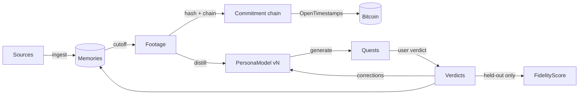
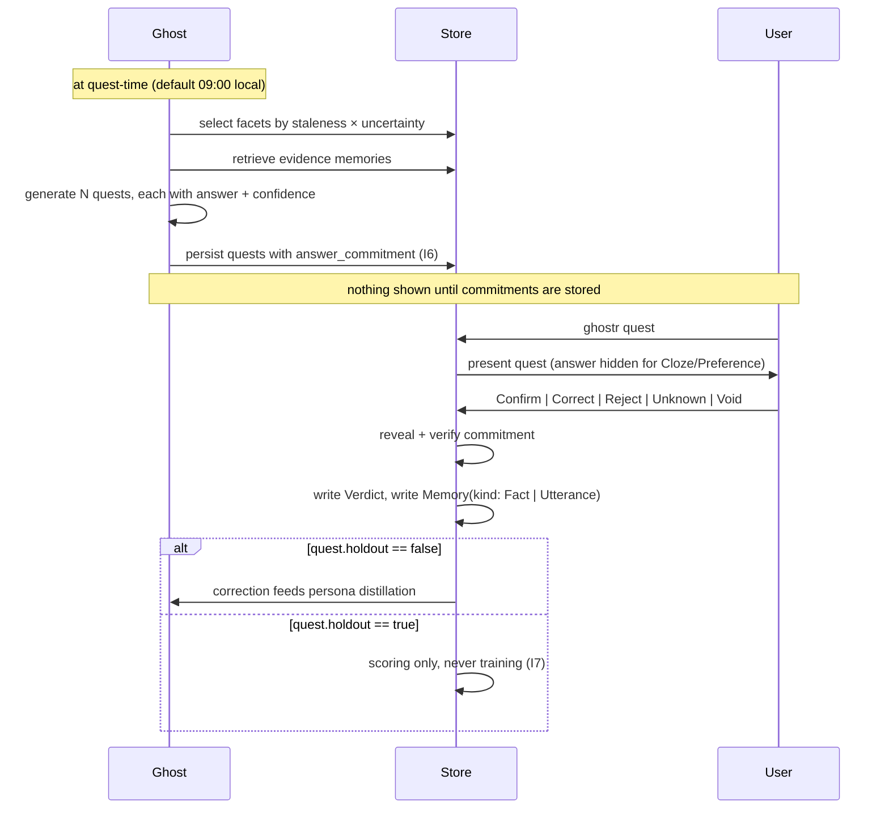
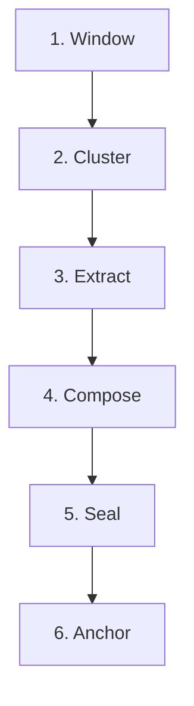

# Ghostr — Product & Protocol Specification

**Status:** Draft v0.2 · M0 and M1 implemented, M2 under way · still changeable
**Scope:** what Ghostr is, what it stores, how the loop runs, how memory is
committed, and what goes on the wire.

Anything ambiguous or underspecified in this document is collected in
[Open Questions](#14-open-questions) at the end, each with a recommended answer.
Those recommendations are not decisions.

---

## Table of contents

1. [Concepts](#1-concepts)
2. [Design invariants](#2-design-invariants)
3. [Data model](#3-data-model)
4. [The quest loop](#4-the-quest-loop)
5. [Fidelity scoring](#5-fidelity-scoring)
6. [The Memoria pipeline](#6-the-memoria-pipeline)
7. [Commitments and Bitcoin anchoring](#7-commitments-and-bitcoin-anchoring)
8. [Identity and key derivation](#8-identity-and-key-derivation)
9. [Nostr event kinds](#9-nostr-event-kinds)
10. [Encryption and storage](#10-encryption-and-storage)
11. [LLM boundary and egress policy](#11-llm-boundary-and-egress-policy)
12. [Verification](#12-verification)
13. [Non-goals](#13-non-goals)
14. [Open questions](#14-open-questions)

---

## 1. Concepts

Four nouns carry the whole product. Everything else is plumbing.

**Ingest** — the user links data sources. Online: a nostr feed, RSS, exported
social archives. Offline: a markdown vault, manual journal entries, structured
logs (places, people, habits). Ingest normalizes all of it into one atomic type,
the `Memory`.

**Ghost** — an agent built on that corpus. It holds a `PersonaModel`: voice,
opinions, relationships, routines. The persona model is *structured and
symbolic*, not a pile of weights, because it has to be versioned, diffed, read by
a human, and argued with.

**Quests** — every day the ghost produces N claims *as the user*, commits to them
before the user sees them, and the user confirms or corrects. Corrections feed
the persona model. Agreement becomes the fidelity score.

**Memoria** — at a configurable cutoff (default: end of day, local time), the
day's memories are compiled into a `Footage`: a structured recap with highlights,
people, mood, open threads, and unresolved loops. Footage is the ghost's
long-term memory substrate. The recap a human can read is a rendering of it, not
the thing itself.

The relationship between them:



Note the two cycles. Corrections feed the persona model, which produces better
quests. Verdicts also become memories, which means the record of *being
corrected* is itself part of the corpus.

---

## 2. Design invariants

Violating any of these is a bug, not a tradeoff.

| # | Invariant |
| --- | --- |
| I1 | Raw memory content is never persisted in plaintext, anywhere, at any time. |
| I2 | A sealed footage is immutable. Corrections are amendments in later footage. |
| I3 | The commitment chain has no gaps and is never rewritten. |
| I4 | Every LLM call goes through the `LanguageModel` trait. No direct HTTP to a provider anywhere else in the tree. |
| I5 | Nothing leaves the device without passing the egress policy and being written to the egress log. |
| I6 | The ghost commits to its answer and confidence *before* the user sees the quest. |
| I7 | The fidelity score is computed only over held-out quests. |
| I8 | Secret key material never appears in a domain type, a log line, an error message, or a `Debug` impl. |
| I9 | Nothing published to a relay contains plaintext identity data. |
| I10 | Ghost-authored public content is always tagged as ghost-authored. |

---

## 3. Data model

Types below are illustrative Rust. They pin down the shape and the invariants,
not the final signatures.

### 3.0 Shared primitives

```rust
/// UUIDv7 everywhere: time-ordered, sortable, no coordination needed.
pub struct MemoryId(Uuid);
pub struct SourceId(Uuid);
pub struct QuestId(Uuid);
pub struct EntityId(Uuid);

/// RFC 3339, always stored UTC, always carrying the originating offset.
pub struct Timestamp { utc: i64, offset_seconds: i32 }

/// A 32-byte domain-separated SHA-256 digest. See §7.1.
pub struct Hash32([u8; 32]);

/// How exposed a piece of content is allowed to be. Drives the egress policy.
pub enum Sensitivity {
    /// Already public. The user published it themselves.
    Public,
    /// Ordinary private content. May egress *redacted* if the user opts in.
    Private,
    /// Never egresses under any policy. Local models only.
    Secret,
}
```

`Sensitivity` is the single most load-bearing enum in the system. It is assigned
at ingest, may only ever be *raised* by later processing, and is checked at the
egress boundary (§11).

### 3.1 Identity

```rust
pub struct Identity {
    /// x-only pubkey hex — also the nostr identity.
    pub id: IdentityId,
    pub npub: Npub,                       // NIP-19 encoding of `id`
    pub derivation: DerivationInfo,       // NIP-06 path + account index
    /// Handle into the keystore. NEVER the key itself. (I8)
    pub signing_key: KeyRef,
    /// The ghost's own keypair, if a ghost has been created.
    pub ghost: Option<GhostBinding>,
    pub relays: Vec<RelayPolicy>,
    pub created_at: Timestamp,
}

pub struct GhostBinding {
    pub pubkey: PublicKey,
    pub created_at: Timestamp,
    pub manifest_ref: EventCoordinate,    // kind 31780 (§9)
    pub revoked_at: Option<Timestamp>,
}
```

The user and the ghost hold **separate keypairs**, both derived from one seed
(§8). This matters for three reasons: the ghost can post without the identity key
ever touching a hot process, a compromised ghost key can be revoked without
burning the user's social graph, and anything signed by the ghost key is
self-evidently ghost-authored (I10).

### 3.2 Source

```rust
pub struct Source {
    pub id: SourceId,
    pub kind: SourceKind,
    pub trust: TrustLevel,
    /// Default sensitivity for memories from this source. Per-memory may be higher.
    pub default_sensitivity: Sensitivity,
    pub cursor: SyncCursor,               // resumable, per-source
    pub schedule: IngestSchedule,
    pub redaction: RedactionPolicy,
    pub enabled: bool,
    pub last_sync: Option<SyncReport>,
}

pub enum SourceKind {
    NostrFeed   { pubkey: PublicKey, relays: Vec<RelayUrl>, kinds: Vec<u16> },
    Rss         { url: Url, etag: Option<String> },
    SocialArchive { format: ArchiveFormat, path: PathBuf },   // Twitter/X, Mastodon, Reddit GDPR exports
    MarkdownVault { root: PathBuf, glob: String },
    Journal,                                                   // typed directly into Ghostr
    StructuredLog { schema: LogSchema, path: PathBuf },        // places, people, habits, health
}

pub enum TrustLevel {
    /// The user authored it. Highest weight for voice modelling.
    FirstParty,
    /// The user asserted it about themselves after the fact.
    SelfReported,
    /// Someone else wrote it. Never used as a voice exemplar. (§11.3)
    ThirdParty,
}
```

`TrustLevel::ThirdParty` is a security control, not a quality signal. Third-party
text is the prompt-injection surface (see THREAT_MODEL §T7): it can be summarized
and referenced, but it never becomes a voice exemplar and never reaches the
instruction channel of a prompt.

### 3.3 Memory

The atomic unit. Immutable once written.

```rust
pub struct Memory {
    pub id: MemoryId,
    pub source_id: SourceId,
    /// When the thing happened. Absent when unknowable.
    pub occurred_at: Option<Timestamp>,
    pub ingested_at: Timestamp,
    pub kind: MemoryKind,
    pub body: MemoryBody,
    pub entities: Vec<EntityRef>,         // local ids; real names live only in the entity table
    pub salience: f32,                    // 0.0..=1.0, how much this should shape the persona
    pub sensitivity: Sensitivity,
    pub provenance: Provenance,
    /// 32 bytes of CSPRNG. Blinds the commitment against dictionary attack. (§7.2)
    pub salt: [u8; 32],
    /// Immutability-preserving correction pointer.
    pub supersedes: Option<MemoryId>,
    pub embedding: Option<VectorId>,
}

pub enum MemoryKind {
    Utterance,      // something the user said or wrote — the voice corpus
    Observation,    // something the user noticed
    Event,          // something that happened, with a time
    Fact,           // a durable claim about the world or the user
    Relationship,   // a claim about a person and the user's tie to them
    Habit,          // a recurring pattern
    Location,       // a place, at a time
    Artifact,       // a file, link, or media reference (content-addressed blob)
}

pub struct Provenance {
    pub source_id: SourceId,
    pub external_id: Option<String>,      // nostr event id, RSS guid, file path + line
    pub url: Option<Url>,
    /// Digest of the raw bytes as ingested, before normalization.
    pub raw_hash: Hash32,
}
```

**Memories are append-only.** A correction writes a new `Memory` with
`supersedes: Some(old_id)`. Reads resolve to the head of the supersession chain
by default. This keeps I2 and I3 intact and preserves the record of the user
changing their mind, which is itself persona-relevant data.

### 3.4 Footage

The output of Memoria for one cutoff period. Sealed and committed.

```rust
pub struct Footage {
    /// Monotonic, gapless, starts at 1. The chain index. (I3)
    pub seq: u64,
    pub date: NaiveDate,                  // local calendar date of the cutoff
    pub tz: Tz,                           // IANA zone actually in effect
    pub window: (Timestamp, Timestamp),   // half-open [start, cutoff)
    pub empty: bool,                      // true when no memories fell in the window

    pub highlights: Vec<Highlight>,
    pub people: Vec<PersonBeat>,
    pub mood: MoodReading,
    pub open_threads: Vec<Thread>,        // started, not finished
    pub closed_loops: Vec<ThreadRef>,     // finished today, opened earlier
    pub unresolved: Vec<OpenQuestion>,    // things the ghost could not determine

    pub memory_ids: Vec<MemoryId>,        // everything in the window, sorted
    pub amendments: Vec<Amendment>,       // corrections to *earlier sealed* footage (I2)
    pub persona_version: PersonaVersion,  // the version in effect when sealed

    pub commitment: Commitment,           // §7
    pub sealed_at: Timestamp,
}

pub struct Highlight {
    pub summary: String,
    pub memory_ids: Vec<MemoryId>,        // every claim traces to evidence
    pub salience: f32,
}

pub struct PersonBeat {
    pub entity: EntityId,
    pub interaction: InteractionKind,     // Met, Messaged, MentionedBy, ThoughtAbout, …
    pub valence: Option<f32>,
    pub memory_ids: Vec<MemoryId>,
}

pub struct MoodReading {
    pub valence: f32,                     // -1.0..=1.0
    pub arousal: f32,                     //  0.0..=1.0
    pub labels: Vec<String>,
    pub confidence: f32,
    pub basis: MoodBasis,                 // Stated | Inferred | Mixed
}

pub struct Thread {
    pub id: ThreadId,                     // stable across days — this is how loops close
    pub title: String,
    pub opened_seq: u64,
    pub last_touched_seq: u64,
    pub state: ThreadState,               // Open | Stalled | Closed | Abandoned
    pub memory_ids: Vec<MemoryId>,
}

pub struct Amendment {
    pub target_seq: u64,                  // an already-sealed footage
    pub reason: AmendmentReason,           // Correction | LateArrival | Redaction
    pub note: String,
    pub memory_ids: Vec<MemoryId>,
}
```

`Thread` is the piece that makes footage a memory substrate rather than a diary.
Threads persist across days with a stable `ThreadId`, so "the tz bug" opened on
day 40 and closed on day 47 is one object with a lifespan, and the ghost can be
asked about open loops without re-reading seven days of text.

**Empty days still seal.** A day with no memories produces `empty: true` footage
and still advances `seq`. Gaps in the chain are indistinguishable from deletion,
so there are no gaps (I3).

### 3.5 Quest

```rust
pub struct Quest {
    pub id: QuestId,
    pub issued_for: NaiveDate,
    pub issued_at: Timestamp,
    pub persona_version: PersonaVersion,  // which ghost made this claim
    pub kind: QuestKind,
    pub facet: Facet,                     // Voice | Opinion | Relationship | Routine | Lore
    pub difficulty: f32,                  // 0.0..=1.0, estimated a priori
    pub evidence: Vec<MemoryId>,          // what the ghost drew on
    /// The ghost's own probability that the user will confirm.
    pub confidence: f32,
    /// Commitment to the answer, published/stored before the user sees it. (I6)
    pub answer_commitment: Hash32,
    /// Held-out quests never feed the persona model; only they are scored. (I7)
    pub holdout: bool,
    /// A deliberately wrong claim. Confirming it is a rubber-stamp signal. (§4.4)
    pub decoy: bool,
    pub expires_at: Timestamp,
    pub status: QuestStatus,
    pub verdict: Option<Verdict>,
}

pub enum QuestKind {
    /// "You'd say X about Y." The core voice test.
    VoiceProbe    { prompt: String, ghost_answer: String },
    /// "You saw Z today." Checks the memory substrate, not the voice.
    FactRecall    { claim: String, as_of: NaiveDate },
    /// "Tomorrow you'll ___." Scored after the horizon passes.
    Prediction    { claim: String, horizon: NaiveDate },
    /// "A or B?" Cheap, high-signal, low-effort for the user.
    Preference    { a: String, b: String, ghost_choice: Choice },
    /// The user's own sentence with a span removed. Ground truth is exact.
    Cloze         { context: String, redacted: Span, ghost_completion: String },
    /// "In situation S you'd ___." Tests generalization past the corpus.
    Counterfactual{ scenario: String, ghost_answer: String },
}

pub enum Verdict {
    /// The ghost got it right.
    Confirm,
    /// Right shape, wrong content. The correction is the training signal.
    Correct { correction: String, severity: Severity },
    /// Wrong entirely.
    Reject  { note: Option<String> },
    /// The user can't say. Scored as neither hit nor miss; tracked separately.
    Unknown,
    /// Bad quest — ambiguous, malformed, or unanswerable. Excluded from scoring.
    Void    { reason: String },
}
```

`Verdict::Void` is deliberately available to the user. A scoring system where the
user cannot throw out a broken question is a scoring system that gets gamed by
asking broken questions.

### 3.6 PersonaModel

```rust
pub struct PersonaModel {
    /// Monotonic counter plus the content hash of the facets. Both, so versions
    /// are ordered *and* content-addressed.
    pub version: PersonaVersion,
    pub parent: Option<PersonaVersion>,
    pub created_at: Timestamp,
    pub facets: Facets,
    pub derived_from: Vec<MemoryId>,
    pub diff: Option<PersonaDiff>,        // vs. parent — what changed and why
}

pub struct Facets {
    pub voice: VoiceProfile,
    pub opinions: Vec<Stance>,
    pub relationships: Vec<Relation>,
    pub routines: Vec<Routine>,
    pub boundaries: Vec<Boundary>,        // negative space: what the user would never say
    pub lore: Vec<LoreFact>,              // durable biographical facts
}

pub struct VoiceProfile {
    pub register: Register,               // formality, warmth, hedging, profanity
    pub lexicon: Vec<LexicalTic>,         // characteristic words/phrases, with rates
    pub syntax: SyntaxStats,              // sentence length distribution, clause depth
    pub punctuation: PunctuationHabits,   // em-dash usage, lowercase, emoji rate
    /// Verbatim user utterances used as few-shot exemplars. FirstParty only.
    pub exemplars: Vec<MemoryId>,
}

pub struct Stance {
    pub topic: String,
    pub position: String,
    pub strength: f32,
    pub stability: f32,                   // has this moved over time?
    pub evidence: Vec<MemoryId>,
    pub last_seen: Timestamp,
    pub contradicted_by: Vec<MemoryId>,   // held explicitly, not silently resolved
}
```

Three things about this shape are load-bearing:

- **It's symbolic.** Every facet is human-readable and every claim carries
  `evidence: Vec<MemoryId>`. You can ask the ghost *why* it thinks you believe
  something and get a straight answer. Fine-tuned weights cannot do this, which
  is why fine-tuning is out of scope through M4 (§13).
- **It's diffable.** `PersonaDiff` is a real type. "The ghost changed its mind
  about you" is a reviewable event.
- **It holds contradictions.** `contradicted_by` is not resolved automatically.
  People are inconsistent, and a model that smooths that out is modelling a
  simpler person than the one it's cloning.

### 3.7 FidelityScore

```rust
pub struct FidelityScore {
    pub as_of: NaiveDate,
    pub window: ScoreWindow,              // Rolling30 | Rolling90 | AllTime
    pub overall: f32,                     // 0.0..=1.0
    pub by_facet: BTreeMap<Facet, FacetScore>,
    pub by_quest_kind: BTreeMap<QuestKindTag, FacetScore>,
    pub sample_size: u32,                 // held-out, non-decoy, non-void quests
    pub confidence_interval: (f32, f32),  // Wilson, 95%
    pub calibration: Calibration,         // Brier score + expected calibration error
    pub integrity: IntegritySignals,      // decoy confirm rate, response latency, streaks
    pub converged: bool,                  // §5.3
    /// Chain seq this score was computed at — ties the number to anchored evidence.
    pub committed_at_seq: u64,
}
```

The score is never a bare percentage in the UI. It always ships with
`sample_size`, `confidence_interval`, and `integrity`, because 100% over 4 quests
is noise and 92% with a 30% decoy-confirm rate is a lie.

---

## 4. The quest loop

### 4.1 Daily cycle



### 4.2 Quest generation

Selection is not random. Each candidate facet gets a priority:

```
priority(facet) = uncertainty(facet)
                × staleness(facet)
                × coverage_debt(facet)
                × (1 - user_fatigue)
```

- **uncertainty** — low-confidence stances, thin evidence, recent contradictions.
- **staleness** — days since this facet was last probed.
- **coverage_debt** — facets under-represented relative to their share of the
  corpus. Keeps the ghost from asking about the same three friends forever.
- **user_fatigue** — recent skip/expire rate. A user who stops answering is worse
  than a user who answers fewer.

Default **N = 5** per day, adaptive in the range 3–10 based on completion rate.
Quest generation must be cheap enough to run on a local model (§11).

### 4.3 The commitment (I6)

Before any quest is displayed:

```
answer_commitment = H_tag("ghostr/v1/quest-answer",
                          quest_id || canonical(ghost_answer) || confidence_bits || nonce)
```

The nonce is stored alongside, and `ghost_answer` is read back off the claim
itself rather than kept in a second column — a commitment to an answer the quest
does not state is one nobody can check. On verdict intake the app re-derives the
commitment and refuses the verdict if it doesn't match. Storage keeps the
commitment, the holdout flag, and the decoy flag immutable after issue while the
claim beside them stays writable, which is what gives that check something to
catch: a question edited between issue and verdict no longer reproduces its own
commitment. This is not primarily
defence against an outside attacker — it's defence against *us*: it makes it
structurally impossible for a future version of the client to peek at the user's
answer and adjust the ghost's before scoring. The commitment is included in the
day's footage Merkle tree, so it is anchored too.

`Cloze` and `Preference` quests hide the ghost's answer until after the verdict.
`VoiceProbe` and `Counterfactual` must show it — that's the question. For those,
`confidence` stays hidden until after the verdict, to avoid anchoring the user's
judgement on the ghost's certainty.

### 4.4 Anti-gaming

The fidelity score is the product claim, which makes it the thing most worth
faking. Four controls:

| Control | What it catches |
| --- | --- |
| **Holdout** (I7) | ~30% of quests are flagged `holdout: true`. Their corrections never enter persona distillation, and *only* they are scored. Prevents the ghost from being graded on its own training data. |
| **Decoys** | ~5% of quests are deliberately wrong — a stance inverted, a person swapped, a routine displaced. A user who confirms decoys is rubber-stamping. `decoy_confirm_rate` is surfaced next to the score, always. |
| **Latency floor** | Verdicts returned faster than a plausible read time are flagged. Not scored differently — just flagged in `IntegritySignals`. |
| **Anchoring** | The quest set, commitments, and verdicts are Merkle-committed into the day's footage and anchored (§7). Backdating a good streak requires breaking SHA-256 or Bitcoin. |

None of this stops a determined user from lying to their own journal. It stops a
*score* from being credible when they do, which is the part that matters when the
number is shown to anyone else.

### 4.5 Corrections into the model

A `Verdict::Correct` produces:

1. A new `Memory` (`kind: Utterance` for voice corrections, `kind: Fact` for
   recall corrections, `TrustLevel::FirstParty`, high `salience`), tagged with
   the quest that produced it so distillation can weight verdict-derived
   content separately.
2. A `PersonaDelta` queued against the implicated facet — **only** when the
   quest was not held out (I7).

Deltas are **not** applied immediately. They accumulate and are applied at the
next persona distillation (§6.4), so a version bump reflects a batch of evidence
rather than one bad morning. A single correction never overwrites a stance backed
by fifty memories; it lowers `strength` and raises `contradicted_by` until the
weight actually shifts. The queue is drained when a version is **adopted**, not
when one is proposed: a diff the user reads and declines must not consume the
corrections it was built from.

A held-out correction still becomes a memory, because it is the user's own
words and discarding it would be a loss. It is filed under a separate source
that distillation does not read. Both halves of I7 are enforced at the point of
application: no delta, and no corpus (Q18).

---

## 5. Fidelity scoring

### 5.1 Per-quest score

```
score(quest) = match verdict {
    Confirm            => 1.0,
    Correct { severity: Minor }    => 0.5,   // right shape, wrong detail
    Correct { severity: Major }    => 0.2,
    Reject             => 0.0,
    Unknown            => excluded from numerator and denominator, counted separately
    Void               => excluded entirely
}
```

`Correct` is partial credit because "you'd say the tooling argument is a
distraction" → "close, but I'd have said it's a *symptom*" is not the same miss
as being wrong about who you had lunch with.

### 5.2 Aggregation

Over held-out, non-decoy, non-void quests in the window:

- **overall** = weighted mean, weight = `difficulty` (hard quests count more).
- **confidence_interval** = Wilson score interval at 95%. Never a naive
  proportion — the sample is small and bounded at 1.0.
- **calibration** = Brier score over `(confidence, outcome)` pairs, plus expected
  calibration error in 10 bins. A ghost that is right 70% of the time and *knows*
  it is more useful than one that is right 75% and always claims 95%.
- **trend** = 30-day EWMA, reported alongside the point estimate.

### 5.3 Convergence

`converged: true` requires **all** of:

| Criterion | Threshold |
| --- | --- |
| `overall` | ≥ 0.85 |
| lower bound of CI | ≥ 0.80 |
| `sample_size` | ≥ 200 held-out quests |
| elapsed | ≥ 60 distinct sealed days |
| coverage | every facet has ≥ 20 scored quests |
| calibration (ECE) | ≤ 0.05 |
| `decoy_confirm_rate` | ≤ 0.10 |

These numbers are a starting hypothesis, not a result (see Open Question Q9).
Convergence is per-facet as well as overall — a ghost can be converged on voice
and nowhere near on routines, and the UI should say so rather than averaging it
away.

---

## 6. The Memoria pipeline

Runs at the cutoff (default 23:59 local, configurable). Six stages. Stages 1–2
and 5–6 are deterministic and testable without a model; only 3–4 touch an LLM.



**1. Window.** Collect memories where `occurred_at` (falling back to
`ingested_at`) is in `[previous_cutoff, cutoff)`. Late arrivals — a nostr note
from three days ago pulled in today — do *not* retroactively enter a sealed
window. They land in today's footage as an `Amendment { reason: LateArrival }`
against the older `seq` (I2).

**2. Cluster.** Group by entity overlap, temporal proximity, and embedding
similarity. Deterministic given the same inputs and a seeded RNG. Produces
candidate highlights and links memories to existing open `Thread`s by
`ThreadId`.

**3. Extract.** Per cluster, a structured LLM call returns strictly typed JSON:
summary, entities, mood contribution, thread state transitions. Free text from
the corpus is passed as *data*, never as instructions (THREAT_MODEL §T7). The
extractor has no tools and no network. Output that fails schema validation is
retried once, then dropped with the cluster marked `unresolved`.

**4. Compose.** Assemble `Footage`: rank highlights by salience, roll up
`PersonBeat`s, compute `MoodReading` (stated mood always outweighs inferred),
diff open threads against yesterday's to find closed loops, and collect
`unresolved` questions the extractor could not answer. Every claim in the footage
must carry at least one `memory_id` — a highlight with no evidence is a
hallucination and is dropped in validation.

**5. Seal.** Compute the Merkle root over the day's leaves, chain it to the
previous link, write `Commitment`, set `sealed_at`. **The footage becomes
immutable at this instant** (I2). Sealing is a single transaction: partial seals
must roll back cleanly, because a half-sealed chain is unrecoverable.

**6. Anchor.** Submit the new chain tip to OpenTimestamps (§7.4). This is
asynchronous and failure-tolerant — an unanchored seal is still a valid chain
link, just without an external time attestation yet. Pending proofs are upgraded
on a retry schedule.

### 6.4 Persona distillation

Runs after sealing, on its own cadence (default: weekly, or when queued deltas
exceed a threshold). Reads the last 90 footages plus accumulated
`PersonaDelta`s, produces a new `PersonaModel` version with a computed
`PersonaDiff` against its parent. Old versions are never deleted — a quest
issued under v12 is scored against v12's claim, not v13's.

**Proposing and adopting are separate steps.** A distillation returns a
candidate with its diff; the version becomes head only when adopted. A
substantial change should not take effect because nobody looked, and the diff is
the review surface that catches a poisoned stance before it starts answering
quests (§11.3).

**Three facets are computed, three need a model.** Voice, relationships, and
routines are measurements — sentence lengths, punctuation rates, who appears and
how often, what recurs. A model asked to estimate them would return a plausible
number instead of the true one. Opinions, boundaries, and lore are not
countable; without a model they are **empty rather than guessed**, and a
distillation without one carries forward what an earlier one with a model found.
An empty facet is honest; a guessed stance is a confident claim with no evidence
behind it.

**Version identity is a tagged hash over canonically-encoded facets**, so two
distillations that found the same thing are the same version. Ratios convert to
fixed point first — canonical CBOR rejects floats — and that conversion *is* the
identity: personas differing below its resolution are deliberately the same
version, because a version bump on noise is one nobody reviews.

A routine is a thread title that has been **opened more than once**, not one
that has stayed open. Counting how many days a thread appears would measure how
long a single to-do lingered, which is the opposite fact.

---

## 7. Commitments and Bitcoin anchoring

The goal: prove that a given memory existed at a given time, without putting any
content on-chain, without leaking anything by publishing, and without paying per
day.

### 7.1 Hashing

All hashes are BIP-340-style tagged SHA-256:

```
H_tag(tag, msg) = SHA256( SHA256(tag) || SHA256(tag) || msg )
```

Tagged hashing gives free domain separation: a memory leaf can never be confused
with a Merkle internal node or a chain link, so cross-structure second-preimage
tricks don't apply. Serialization for hashing is **deterministic CBOR**
(RFC 8949 §4.2 core deterministic encoding) — canonical map ordering, definite
lengths, no floats where an integer will do. Hashes are computed over canonical
CBOR, never over JSON, never over a `Debug` rendering.

Tags in use:

```
ghostr/v1/memory-leaf
ghostr/v1/quest-leaf
ghostr/v1/meta-leaf
ghostr/v1/node
ghostr/v1/footage-root
ghostr/v1/link
ghostr/v1/genesis
ghostr/v1/quest-answer
```

### 7.2 Leaves (salted, so the tree can't be brute-forced)

```
memory_leaf(m)  = H_tag("ghostr/v1/memory-leaf",  m.salt || canonical_cbor(m))
quest_leaf(q)   = H_tag("ghostr/v1/quest-leaf",   q.nonce || canonical_cbor(q_public_fields))
meta_leaf(f)    = H_tag("ghostr/v1/meta-leaf",    canonical_cbor(f.metadata))
```

The salt is essential. A memory is often low-entropy — "saw Nan today" has maybe
30 bits of guessable content. An unsalted commitment to it is a hash anyone can
confirm by guessing. 32 random bytes per memory makes the commitment
hiding as well as binding.

### 7.3 The chain

Leaves are sorted by digest and placed in an RFC 6962-style Merkle tree with
distinct leaf and internal prefixes (already handled by the tag separation
above):

```
root_n = merkle_root([ meta_leaf, memory_leaf*, quest_leaf* ])
```

Then each day links to the last:

```
link_0 = H_tag("ghostr/v1/genesis", identity_pubkey || genesis_timestamp || chain_id)

link_n = H_tag("ghostr/v1/link",
               link_{n-1} || root_n || u64_be(seq_n) || date_n || tz_n)
```

Properties this buys:

- **Append-only.** Changing anything in day 40 changes `root_40`, which changes
  `link_40`, which changes every link after it. If day 41+ is anchored, day 40 is
  frozen too — you only need to anchor the tip.
- **Gapless.** `seq` is in the preimage, so a day cannot be silently dropped.
  Empty days seal as empty (§3.4).
- **Selectively revealable.** To prove one memory existed on day 40, reveal that
  memory, its salt, its Merkle inclusion path to `root_40`, and the link chain
  from 40 to an anchored tip. Nothing else in the day is disclosed.
- **Crypto-shreddable.** Delete a memory's content and salt, keep its leaf hash.
  The chain still verifies; the content is unrecoverable. This is how deletion
  and immutability coexist (Q6).

### 7.4 Anchoring to Bitcoin

**Scheme: daily OpenTimestamps on the chain tip, with a weekly reinforcement.**

1. At seal time, submit `link_n` to ≥ 2 independent OTS calendar servers.
2. Store the returned `.ots` proof (initially a *pending* attestation) at
   `anchors/<seq>.ots`.
3. On a retry schedule (hourly for 24h, then daily for 7d), attempt to upgrade
   pending proofs. Once a calendar's aggregated Merkle root lands in a Bitcoin
   transaction, the upgraded `.ots` contains a complete path: `link_n` → calendar
   aggregation → transaction → block header merkle root → block height.
4. Record the resulting `AnchorState`:

```rust
pub enum AnchorState {
    Unanchored,
    Pending  { submitted_at: Timestamp, calendars: Vec<Url> },
    Confirmed{ block_height: u32, block_time: Timestamp, ots_path: PathBuf },
    Failed   { attempts: u32, last_error: String },
}
```

**Why OTS rather than an OP_RETURN per day:** OTS calendars aggregate thousands
of digests into one transaction, so the marginal cost of a daily anchor is zero
and there is no wallet, no UTXO management, and no fee estimation in the
critical path. The tradeoff is a dependency on calendar availability and a
timestamp granularity of hours rather than minutes. Neither matters for a daily
journal. Users who want independence can opt into a direct OP_RETURN anchor of a
weekly or monthly tip; that path is out of scope until M4 (§13).

**Why the tip is sufficient:** because the chain is a hash chain, anchoring
`link_n` transitively timestamps every `link_{<n}`. Daily anchoring is belt and
braces — it bounds how much history is exposed if a run of anchors fails, and it
gives every individual day its own independently checkable proof rather than
requiring a walk to the tip.

**What is *not* proven:** OTS proves a hash existed *no later than* a block time.
It cannot prove a memory was not created earlier and backdated within the app,
and it cannot prove the content is true. Anchoring establishes *existence and
ordering*, not honesty. See THREAT_MODEL §T9.

---

## 8. Identity and key derivation

### 8.1 Seed and paths

Ghostr uses **NIP-06**: a BIP-39 mnemonic, BIP-32 derivation at
`m/44'/1237'/<account>'/0/0`, secp256k1, x-only pubkeys per BIP-340.

| Account | Role | Used for |
| --- | --- | --- |
| `0'` | **Identity key** | The user's nostr identity. Signs the ghost manifest, revocations, and anything the user publishes as themselves. |
| `1'` | **Ghost key** | The ghost's own identity. Signs ghost-authored content. Rotatable. |
| `2'` | **Anchor key** | Publishes anchor receipts, if the user opts into publishing them at all. Unlinkable from `0'` unless deliberately linked. |
| `3'` | **Data key** | Encrypts app-data events published to relays (NIP-44 self-encryption). |

Separating these is what makes selective disclosure possible. A user can publish
anchor receipts from account `2'` and prove liveness of a chain without revealing
whose chain it is; they can point a NIP-46 remote signer at account `0'` and keep
the identity key off the machine entirely while the ghost still runs.

The mnemonic is entered or generated once at `ghostr init`, never written to disk in
plaintext, and stored per §10.1.

### 8.2 The ghost binding

The user attests the ghost with a signed manifest (kind `31780`, §9) from the
identity key:

```
GhostManifest {
  ghost_pubkey, created_at, persona_version, policy, chain_id, genesis_link,
  status: Active | Suspended | Revoked
}
```

This is the artifact that makes "provably his ghost" a checkable statement rather
than a claim: a third party fetches the manifest, verifies the identity key's
signature, and now knows which pubkey the user vouches for. Revocation is a
manifest update with `status: Revoked` — no key burning, no social-graph loss.

### 8.3 Signing

All signing goes through a `Signer` trait (ARCHITECTURE §4). Implementations:
local keystore, NIP-46 remote signer / bunker, and hardware. Nothing in the tree
constructs a signature from raw key bytes outside `ghostr-crypto`.

---

## 9. Nostr event kinds

### 9.1 Proposed block: 31780–31789

Addressable events (30000 ≤ kind < 40000) are replaceable per
`(pubkey, kind, d-tag)`, which is exactly right for versioned app state.

> **These kinds are unclaimed, not assigned.** Nothing in nostr prevents
> collision. Before implementation, check the block against the NIPs repo and the
> live kind registry, and submit a NIP reserving it. Until then every event is
> **also** mirrored under **NIP-78 kind 30078** with
> `d = "ghostr/v1/<type>/<id>"`, so a client that only understands NIP-78 still
> sees consistent state. See Q3.

| Kind | Type | `d` tag | Author | Content | Public? |
| --- | --- | --- | --- | --- | --- |
| `31780` | `GhostManifest` | `ghostr/v1/ghost/<chain_id>` | identity `0'` | plaintext JSON | **Public** — it's an attestation, it has to be readable |
| `31781` | `SourceDescriptor` | `ghostr/v1/source/<source_id>` | data `3'` | NIP-44 self-encrypted | Private |
| `31782` | `PersonaVersion` | `ghostr/v1/persona/<version>` | data `3'` | NIP-44 self-encrypted | Private |
| `31783` | `FootageRecord` | `ghostr/v1/footage/<seq>` | data `3'` | NIP-44 self-encrypted | Private |
| `31784` | `AnchorReceipt` | `ghostr/v1/anchor/<seq>` | anchor `2'` | plaintext: `seq`, `link_n`, `.ots` (base64) | Opt-in public — hashes only |
| `31785` | `QuestSet` | `ghostr/v1/quests/<date>` | data `3'` | NIP-44 self-encrypted | Private |
| `31786` | `FidelityAttestation` | `ghostr/v1/fidelity/<window>` | identity `0'` | plaintext JSON | Opt-in public |
| `31787` | `DeviceRegistration` | `ghostr/v1/device/<device_id>` | identity `0'` | NIP-44 self-encrypted | Private |
| `31788` | `RevocationNotice` | `ghostr/v1/revocation/<target>` | identity `0'` | plaintext JSON | **Public** — a revocation nobody can read is not a revocation |
| `31789` | *reserved* | — | — | — | — |

### 9.2 Standard kinds also used

| Kind | NIP | Use |
| --- | --- | --- |
| `0` | NIP-01 | Profile metadata for the ghost pubkey, marked as a bot/ghost account |
| `1` | NIP-01 | Ghost-authored notes, **only** when the user has explicitly enabled publishing |
| `1059` | NIP-59 | Gift wrap, for private events where kind and author must also be hidden (§10.3) |
| `10002` | NIP-65 | Relay list metadata |
| `24133` | NIP-46 | Remote signer transport, when the identity key is held off-device |

### 9.3 Mandatory disclosure on ghost-authored content (I10)

Any kind-1 event signed by the ghost key carries:

```json
["ghostr", "v1", "ghost-authored"]
["p", "<identity_pubkey>", "", "principal"]
["client", "ghostr"]
```

Non-negotiable. A ghost that can pass as its principal without a machine-readable
marker is an impersonation tool, and that is a different product than this one.
Publishing is **off by default** and requires explicit per-scope opt-in.

### 9.4 The FidelityAttestation is the public claim

```json
{
  "chain_id": "...",
  "as_of": "2026-08-25",
  "window": "rolling_90",
  "overall": 0.87,
  "sample_size": 241,
  "ci": [0.82, 0.91],
  "ece": 0.037,
  "decoy_confirm_rate": 0.04,
  "committed_at_seq": 412,
  "link": "<link_412 hex>",
  "ots": "<base64 .ots proof>"
}
```

Signed by the identity key, it says: *here is my ghost's score, and here is the
Bitcoin-anchored commitment to the quest record it was computed from.* A verifier
can check the signature, check the OTS proof, and — if the user chooses to reveal
the held-out quest set — recompute the score themselves from the Merkle paths.

---

## 10. Encryption and storage

### 10.1 Key hierarchy at rest

```
passphrase ──Argon2id──▶ KEK ──unwraps──▶ seed ──NIP-06──▶ identity secret key
   (m=256MiB, t=3, p=4)                                            │
                                  HKDF-SHA256(ikm = sk, info = label)
                                                                   │
                                                                  DEK
                                                                   │
                                     XChaCha20-Poly1305 ──▶ database + blobs
```

- The passphrase never leaves the process. The KEK is derived on unlock, held in
  `zeroize`-on-drop memory, and `mlock`ed where the platform allows.
- **The DEK is derived from the identity secret key, not stored.** The store is
  therefore readable only by whoever can reach the nostr key, and there is no
  second secret to back up, lose, or leak. Nothing on disk holds the DEK.
- **The seed is what gets wrapped, not the DEK.** A passphrase change rewraps 64
  bytes and leaves the DEK untouched — it derives from a key that did not
  change — so the corpus is never re-encrypted.
- On macOS/iOS the wrapped seed goes to Keychain; on Linux to the Secret Service
  when present, otherwise an encrypted file; on Windows to DPAPI + file.

### 10.2 Local store

SQLite with application-level envelope encryption on sensitive columns (not
SQLCipher — the goal is to keep the deployment dependency-free and the encryption
auditable in our own tree). Every row carrying memory content stores
`XChaCha20-Poly1305(nonce, DEK, plaintext, aad = row_type || row_id)`. The AAD
binds ciphertext to its row, so a swapped row fails to decrypt rather than
silently returning someone else's memory.

Indexed metadata (timestamps, source ids, entity ids, seq numbers) is *not*
encrypted, because it has to be queryable. That is a deliberate, documented leak:
an attacker with the database file but not the DEK learns the shape of the
corpus — how much, how often, how many people — but not its content. See
THREAT_MODEL §T1.

Blobs (media, archives) are content-addressed and encrypted with per-blob keys
wrapped by the DEK.

Vector embeddings are treated as content, not as metadata: they are invertible
enough to reconstruct much of the text they came from. They are therefore
computed **locally only** — there is no remote embedding path and there is not
going to be one, including for `Public` memories, because a rule with an
exception is a rule with a failure mode — and they are **encrypted at rest like
any other content column**.

That rules out an ANN extension, which needs the vectors in the clear. The index
is an encrypted table scanned exhaustively: each vector is stored normalised, so
cosine similarity is a dot product, and a query decrypts each row and scores it.
The vector's *width* is stored in the clear, because width is shape and shape is
already the documented leak above. Changing embedding model is a resumable
rebuild: vectors already at the new width are kept, and the rest are re-embedded
from the work queue.

### 10.3 On the wire

Private app data published to relays is NIP-44 v2, self-encrypted (conversation
key = ECDH(data_key, data_pubkey)). Relays store ciphertext they can never read.

NIP-44 hides content but not metadata: pubkey, kind, `d` tag, `created_at`, and
ciphertext length are all visible to a relay. For users who need that hidden too,
private events can be wrapped in NIP-59 gift wrap (kind `1059`) with an ephemeral
sender key and randomized timestamps. This costs discoverability and is opt-in.
Padding to size buckets is applied in both modes. See THREAT_MODEL §T2.

---

## 11. LLM boundary and egress policy

### 11.1 The trait boundary (I4)

Every model call in the system goes through `LanguageModel` / `Embedder`
(ARCHITECTURE §4). No crate other than `ghostr-llm` may open a network connection
to a model provider. This is enforced by review and by a dependency lint — the
provider HTTP clients are feature-gated dependencies of exactly one crate.

The default configuration is a **local model** (Ollama-compatible, targeting an
~8B-class quantized model as the floor, Q7). Remote providers are opt-in, per
task, and never the default for anything.

### 11.2 The egress gate (I5)

Nothing reaches a remote provider without passing:

```rust
pub trait EgressPolicy {
    fn evaluate(&self, req: &EgressRequest) -> EgressDecision;
}

pub enum EgressDecision {
    Allow,
    AllowRedacted(RedactionPlan),
    Deny { reason: DenyReason },
}
```

Rules, in order:

1. `Sensitivity::Secret` → **Deny**, unconditionally, no override.
2. Remote provider not explicitly enabled for this task → **Deny**.
3. Real entity names → replaced with stable pseudonyms (`Person A`, `Place C`).
   The mapping table never leaves the device.
4. Detected secrets (keys, tokens, card numbers, national IDs) → **Deny** with a
   surfaced warning, not silent redaction.
5. Otherwise → **AllowRedacted** with the plan attached.

Every decision — allow *and* deny — is written to an append-only `EgressLog`
with the provider, task, byte count, redaction plan, and a hash of the exact
payload sent. `ghostr egress log` prints it. If a user cannot audit what left their
machine, the privacy claim is unverifiable, which makes it worthless.

Append-only is enforced by triggers in the schema rather than by application
code, so "this record was written and cannot be edited" is a database fact. The
payload itself is never stored — that would make the audit log a second copy of
the corpus — only its digest, which is enough to prove what was sent to anyone
who kept the redacted copy.

**Configuration.** Two settings, deliberately separate:

```toml
egress_enabled = false                     # the master switch
egress_allow   = anthropic:summarization   # provider:task pairs
```

Per task, not per provider: enabling a provider for conversation must not
silently enable it for bulk extraction over the whole corpus. With
`egress_enabled = false` no allow entry does anything, so turning it all off
never means editing a list. `embedding` cannot be named in `egress_allow` at
all — there is no remote embedding path and configuration must not be able to
invent one (Q13).

**Seeing it before it happens.** `ghostr memoria --dry-run --remote` prints the
exact bytes that would leave, after redaction, along with the decision for each.
The payload and the decision come from the same code path a real call takes, so
a dry run cannot drift from what actually happens — a preview showing something
other than the truth would be worse than no preview. `Secret` content does not
even reach the gate on that path: it is counted and dropped before a prompt is
built, which is one fewer place for it to go wrong.

### 11.3 Prompt construction

- Corpus text is **data**, never instruction. It is delimited and typed, and the
  extraction path uses structured output with schema validation.
- The extraction and quest-generation paths run with **no tools and no network
  access** available to the model. There is nothing for an injected instruction
  to actuate.
- `TrustLevel::ThirdParty` content never becomes a voice exemplar.
- Prompts are versioned assets with snapshot tests (CLAUDE.md), because a prompt
  change is a behaviour change to the persona model.

### 11.4 What leaks where — summary

| Path | Sees what | Default |
| --- | --- | --- |
| Local model | Everything, including `Secret` | **On** |
| Remote model | Redacted, pseudonymized, `Public`/`Private` only | Off |
| Relay (private kinds) | Ciphertext + metadata (pubkey, kind, time, size) | Off until M3 |
| Relay (anchor receipts) | A hash and a timestamp | Off |
| OTS calendars | A 32-byte digest + your IP | On (via Tor/proxy if configured) |
| Local disk | Ciphertext + unencrypted index metadata | Always |

---

## 12. Verification

`ghostr verify` is a first-class command and must be runnable by a third party
against an exported bundle, with no Ghostr install state:

1. **Chain integrity** — recompute `link_n` from `link_{n-1}`, `root_n`, `seq`,
   `date`, `tz` for every sealed day. Any mismatch names the first bad `seq`.
2. **Merkle inclusion** — for each revealed memory, verify the path to `root_n`.
3. **Anchor** — verify each `.ots` proof against a Bitcoin block header. Requires
   a header source: a full node, an Electrum server, or (with a stated trust
   assumption) a block explorer.
4. **Signatures** — verify the ghost manifest and any fidelity attestation
   against the identity pubkey.
5. **Score recomputation** — given a revealed held-out quest set, recompute
   `overall`, the CI, and the calibration numbers, and compare to the attestation.

Exit codes are machine-readable per check, so this can run in CI against a
published attestation.

---

## 13. Non-goals

Explicitly out of scope through M4:

- **Fine-tuning or LoRA on user data.** The persona model is symbolic on purpose
  (§3.6). Weights are not diffable, not auditable, and not deletable.
- **A hosted service.** No accounts, no server-side corpus, no sync backend
  beyond encrypted relay storage.
- **Voice/video cloning.** Different consent problem, different threat model.
- **Autonomous posting.** The ghost never publishes unprompted. Publishing is
  opt-in, per-scope, always disclosed (§9.3).
- **Multi-user / shared ghosts.** One identity, one ghost.
- **Death, succession, and inheritance.** The obvious endgame for a "digital
  ghost", and deliberately deferred — it needs its own spec and its own threat
  model (Q12).
- **Protection against a compromised OS or a coerced user.** See THREAT_MODEL.

---

## 14. Open Questions

Where the brief was ambiguous or underspecified, the question is here rather than
silently decided in the text above. Each carries a **recommendation** — that is a
proposal with reasoning, not a resolution. Nothing here is settled.

---

**Q1 — Does the ghost ever post publicly, and under whose key?**

The brief says "the account is provably *his ghost*", which implies an account
that speaks. But a ghost posting under the user's own key is indistinguishable
from the user, and that is an impersonation tool.

> **Recommendation:** the ghost gets its own keypair (NIP-06 account `1'`), bound
> by a signed manifest from the identity key (§8.2). Publishing is **off by
> default**, opt-in per scope, and every ghost-authored event carries a
> machine-readable disclosure tag (§9.3). The identity key never signs
> ghost-generated content. If we later want a "ghost replies in my threads" mode,
> it still runs from the ghost key.

---

**Q2 — Is the fidelity score private, or published?**

A private score is a personal metric. A published one is a reputation claim, and
reputation claims attract forgery.

> **Recommendation:** private by default. Publishing is an explicit action that
> emits a `FidelityAttestation` (kind `31786`) signed by the identity key and
> bound to an anchored chain seq, so the number is checkable rather than
> asserted. Never publish a score below the convergence thresholds without a
> prominent "not converged" flag in the payload itself.

---

**Q3 — Which nostr kinds, given none are actually reserved?**

The 31780–31789 block in §9.1 is unclaimed but not assigned. Collisions are
possible and nothing prevents them.

> **Recommendation:** ship on 31780–31789, **and simultaneously** mirror every
> event under NIP-78 kind `30078` with a `ghostr/v1/...` `d` tag, so correctness
> never depends on the block being ours. Submit a NIP reserving the block before
> M3. Verify against the live kind registry at implementation time — if there's a
> collision, move the block; the `d`-tag namespace is the real identifier.

---

**Q4 — Anchor granularity: daily, weekly, or on-demand?**

Daily OTS is free but adds a network call and a pending-proof queue per day.

> **Recommendation:** daily via OTS, as specified in §7.4. The cost is zero
> because calendars aggregate, and per-day proofs mean a user can prove one day
> without revealing a walk to the tip. Add an opt-in direct OP_RETURN anchor for
> monthly tips at M4 for users who don't want a calendar dependency.

---

**Q5 — Are anchor receipts published to relays? They leak liveness.**

An `AnchorReceipt` contains only a hash — but a stream of them from a known
pubkey publicly broadcasts "this person journaled every day, and stopped on the
14th." That's a real leak (THREAT_MODEL §T2).

> **Recommendation:** **local-only by default.** The `.ots` file on disk is
> already a complete proof; publishing adds availability, not validity. When a
> user does opt in, publish from the unlinkable anchor key (account `2'`), never
> from the identity key, and jitter the publish time.

---

**Q6 — How do deletion and immutability coexist?**

I2 and I3 say memory is append-only and the chain is never rewritten. Users
delete things. Third parties in the corpus have a moral (and in some
jurisdictions legal) claim to deletion.

> **Recommendation:** **crypto-shredding.** Because leaves are salted (§7.2),
> deleting a memory's content *and its salt* leaves a leaf hash that still
> verifies the chain while the content becomes unrecoverable and the commitment
> becomes unopenable. The chain records that something was there and when;
> nothing records what. Expose this as `ghostr forget <memory|person>`, with a
> `Redaction` amendment recorded in the current day's footage. This is the one
> mechanism that lets us keep both invariants honestly.

---

**Q7 — What is the baseline local model, and what happens if it isn't good
enough?**

Quest generation and footage extraction have real quality floors. An 8B model may
not clear them for `VoiceProbe` or `Counterfactual`.

> **Recommendation:** target an Ollama-compatible ~8B-class quantized model as the
> supported floor, and design the pipeline so quality degrades by *quest kind*
> rather than failing: `Cloze`, `Preference`, and `FactRecall` are mechanical and
> work on a small model; `VoiceProbe` and `Counterfactual` need more. If the
> local model can't clear a quality bar, generate fewer quests of the easy kinds
> rather than bad quests of the hard ones — and say so in the UI. Benchmark this
> in M2 with a fixed eval set before committing to the floor.

---

**Q8 — How many quests per day?**

Too few and the score never reaches significance; too many and the user quits,
which is worse.

> **Recommendation:** default **N = 5**, adaptive 3–10 on completion rate. At 5/day
> with a 30% holdout, 200 held-out quests takes ~130 days — slower than the 60-day
> convergence floor. Either raise the holdout fraction early (50% for the first
> month, when there's nothing to train on anyway) or accept that convergence takes
> a season. Recommend the former; it costs nothing and front-loads the evidence.

---

**Q9 — What actually counts as "converged"?**

§5.3's thresholds (0.85 / n≥200 / 60 days / ECE≤0.05) are a hypothesis with no
empirical basis yet.

> **Recommendation:** ship them as *defaults in config*, not constants in code,
> and treat the first cohort's data as the calibration study. The honest framing
> in the UI is a confidence interval and a trend line, not a pass/fail badge —
> "provably his ghost" should be a claim the *evidence* supports, not a threshold
> we picked.

---

**Q10 — Which device seals, when there are several?**

Two devices sealing the same `seq` forks the chain, and a forked chain is
worthless.

> **Recommendation:** exactly one **sealing device** per chain, named in the ghost
> manifest. Other devices are ingest/read replicas: they can add memories and
> answer quests, but only the sealer runs Memoria and advances `seq`. Handover is
> an explicit, signed manifest update. Automatic election is tempting and wrong —
> partition plus election equals fork.

---

**Q11 — What is "a day" when the user travels?**

Cutoff at 23:59 local is ambiguous across a timezone change; a westward flight
can produce a 30-hour day.

> **Recommendation:** seal on the identity's configured **home timezone**, and
> record the actual `tz` in effect in the footage (§3.4). Windows are half-open on
> absolute UTC instants, so no memory is ever double-counted or dropped regardless
> of what the wall clock did. A long or short day is a real fact about that day and
> the footage should show it.

---

**Q12 — What happens when the user dies?**

It is called a digital ghost. This is the question everyone will ask, and the
brief doesn't address it.

> **Recommendation:** **out of scope for v1**, stated plainly rather than hinted
> at. Note in the docs that the architecture admits it later — the ghost key is
> separable, the corpus is already portable and encrypted, and a dead-man's switch
> plus Shamir-split key escrow is a well-understood construction. But succession
> raises consent questions (for the user *and* everyone in their corpus) that
> deserve their own spec, and building it half-way is worse than not building it.

---

**~~Q13 — Which embedding model and vector store?~~ — resolved in M1.**

*Local embeddings only, and an encrypted exhaustive index rather than
`sqlite-vec`.* The local-only half of the recommendation stands as written and
is now §10.2. The index half did not survive contact with I1: `sqlite-vec` — and
every ANN library like it — searches a **plaintext** vector table, so adopting
one would have meant writing the most reconstructible representation of the
corpus to disk in the clear, which is the exact thing the invariant exists to
prevent. Encrypting the vectors and scanning them costs a few hundred
milliseconds on a corpus of 100 000 memories, next to a local model call
measured in seconds. If a corpus ever outgrows that, the answer is an encrypted
ANN structure, not a plaintext one. Re-embedding on a model change is resumable
as recommended: `rebuild` keeps vectors already at the new width and the caller
drains the remainder.

---

**Q14 — Other people's data is in the corpus, and they didn't consent.**

Every `PersonBeat` is a claim about someone who never agreed to be modelled.

> **Recommendation:** pseudonymize by default at the egress boundary — real names
> never reach a remote provider (§11.2). Support `ghostr forget <person>` as a
> first-class operation that crypto-shreds every memory naming them (Q6). Never
> publish `PersonBeat` data, even encrypted, without a separate explicit action.
> This is a design constraint, not a legal disclaimer; the product should be
> defensible to the people *in* it, not just to its user.

---

**Q15 — Licensing and contribution mechanics.**

MIT is fixed by the brief. The rest isn't.

> **Recommendation:** MIT, **DCO sign-off, no CLA**. A CLA on a privacy tool is a
> trust smell — it signals a future relicense. Add `SECURITY.md` with a
> disclosure address before any code ships, since this project explicitly invites
> attack.

---

**Q16 — Do corrections retro-edit sealed footage?**

The brief says corrections feed back into the persona model, but not what happens
to a footage that turns out to be wrong.

> **Recommendation:** no rewrites, ever (I2). A correction is an `Amendment` in
> the *current* footage pointing at the earlier `seq` (§3.4). Rendering a footage
> shows its amendments inline, so the reader sees the corrected version while the
> chain still commits to what was originally recorded. "The ghost was wrong on
> day 40 and found out on day 47" is information worth keeping.

---

**Q17 — Does the user see the ghost's confidence before answering?**

Showing it anchors the user's judgement; hiding it costs a useful signal.

> **Recommendation:** **hidden until after the verdict.** Calibration (§5.2) is
> only measurable if confidence doesn't influence the outcome it's predicting.
> Reveal it immediately after, where "the ghost was 91% sure and wrong" is the
> most interesting thing on the screen.

---

**~~Q18 — Are verdicts themselves memories?~~ — resolved in M2.**

*Yes, and held-out ones are quarantined by source.* The recommendation stands
and is now §4.5: a correction is first-party utterance data and among the
highest-quality signal the corpus receives, tagged with the quest that produced
it so distillation can weight it separately.

The guard the recommendation asked for turned out to need a stronger form than
"exclude them from the evidence pool for held-out quests". The leak is not only
into a held-out quest's evidence; it is into the **persona itself**. A held-out
correction produces no `PersonaDelta` — that was already enforced — but the
memory it produces is read by distillation like any other, so the ghost would
train on the answer to a question it is about to be scored on, through the
corpus rather than through the queue.

So held-out corrections are filed under their own source, and distillation
reads every first-party source **except** that one. The split is by source
rather than by trust level or by a naming convention, because a foreign key is
checkable and a convention is something somebody has to remember. The words are
kept, not dropped: they are the user's own, and the quest they answered still
carries them.

---

**Q19 — Where does a passphrase change get its salt?**

`Keystore::change_passphrase(new_passphrase)` cannot be implemented at that
signature. Re-wrapping the seed needs a fresh Argon2id salt and a fresh
XChaCha20 nonce; the method is handed neither, and drawing them inside
`ghostr-crypto` would put `OsRng` outside the composition root, which §11.4 and
CLAUDE.md §6 both forbid. Reusing the stored salt is worse than it looks: it
wraps a new KEK under parameters chosen for an old one, and it lets anyone who
kept a copy of the old file confirm a guess against both wrappings at the cost of
one derivation.

The same gap exists on `Signer::nip44_encrypt`, which needs a per-message nonce.
That one is resolved here: the nonce is a parameter, matching
`FileKeystore::create`, which already takes its salt and nonce for exactly this
reason.

> **Recommendation:** the same treatment —
> `change_passphrase(new_passphrase, salt, nonce)`. It keeps entropy in the
> composition root, makes the operation reproducible under a seeded RNG in tests,
> and is consistent with every other function in the crate that needs randomness.
> The alternative worth considering is requiring the **old** passphrase as well,
> which would additionally stop a passer-by from re-keying an unlocked vault; the
> cost is that it can no longer be offered as "you are already unlocked, pick a
> new passphrase". Until this is settled the method returns
> `Backend { operation: "change_passphrase needs a caller-supplied salt" }` — a
> refusal rather than a wrong rewrap, because a rewrap that loses the seed is not
> recoverable.

---

**Q20 — Who holds the ephemeral key for a NIP-59 gift wrap?**

Gift wrap is three layers: a rumor, a **seal** (kind 13) encrypted to the
recipient and signed by the real author, and a **wrap** (kind 1059) encrypted and
signed by a throwaway key that exists only for that one event. The throwaway key
is the point — it is what hides the author from a relay.

`ghostr-nostr` cannot hold it. §11.3 and ARCHITECTURE §3 rule 4 put secret key
bytes in `ghostr-crypto` alone, so `privacy::gift_wrap` cannot derive a key from
entropy handed to it, and it cannot sign the wrap either. The scaffold's
signature — `gift_wrap(event, ephemeral_entropy)` returning an unsigned event —
also names no recipient, so there is nobody to encrypt to.

> **Recommendation:** add one method to `Signer`:
> `gift_wrap(&self, key, recipient, rumor, ephemeral_entropy, nonces) ->
> Result<SignedEvent>`, returning the finished wrap. The ephemeral key is born
> and zeroized inside `ghostr-crypto`, never crosses a crate boundary, and never
> reaches a domain type — the same treatment the identity key gets. `ghostr-nostr`
> keeps [`PrivacyMode::GiftWrapped`] as the policy decision and delegates the
> cryptography, which is the split every other seam in this tree already uses.
>
> The alternative — a general "sign with this ephemeral key" primitive — is
> rejected: it is a signing oracle for arbitrary bytes under an
> attacker-chosen key, and its only caller would be this one.
>
> Until this is settled `gift_wrap` is `todo!()` and `PrivacyMode::GiftWrapped`
> cannot be selected. NIP-59 is opt-in and not on the M3 exit criteria
> ([ROADMAP](ROADMAP.md)), so nothing else is blocked.

---

**Q21 — If the identity key is imported or held elsewhere, where do the other three accounts come from?**

§8.1 derives four accounts — identity, ghost, anchor, data — from one BIP-39
seed by NIP-06. That works because the seed is ours and we hold it. Two things
users ask for break it:

1. **Log in with an existing `nsec`.** An `nsec` is a raw private key, not a
   seed. There is no BIP-32 tree under it, so there is nothing to derive
   `1'`, `2'` and `3'` *from*.
2. **Sign with a hardware wallet, or any external signer.** The key never
   leaves the device it lives on.

The tempting answer is to derive the other three by HKDF from the identity secret
— deterministic, and recoverable from the `nsec` alone.

> **It cannot be that.** HKDF needs the identity secret *bytes*, and the entire
> point of an external signer is that those bytes never reach us. A scheme that
> works for an imported `nsec` and collapses the moment the same user moves that
> key to hardware is a scheme that has to be replaced exactly when it matters
> most — and replacing it means re-deriving `Account::Data`, which is where the
> DEK comes from (§10.1), which means re-encrypting the vault.

> **Recommendation: derive nothing from the identity key. Bind instead.**
>
> - **Ghost, anchor and data** always come from a locally-held *vault seed*,
>   generated at `init` and never leaving the device. They are what the vault
>   needs to function offline, and none of them is the user's public identity.
> - **The identity account** is whatever the user brought: a key derived from the
>   vault seed (today's default), an imported `nsec`, or a pubkey whose secret
>   lives behind a [`Signer`] we can only ask. All three are the same to every
>   call site, which is the seam `Signer` already promises.
> - The link between them is a **signature, not a derivation**: the identity key
>   signs a `GhostManifest` (§8.2) naming the ghost pubkey. That is already how a
>   reader learns which ghost belongs to which person, so binding costs no new
>   mechanism — and it is the only form of binding an external signer can
>   produce.
>
> The cost is honest and should be stated in the UI: **two things to back up**,
> the identity key and the vault seed. Losing the vault seed loses the chain;
> losing the identity key loses the ability to speak as that identity but not the
> journal. Deriving everything from one secret would have made a single backup
> enough, and that is a real convenience this trade gives up — in exchange for an
> identity that can move to hardware without re-encrypting the vault.
>
> Consequence for §8.1: the account table stays, but "derived from the seed" is
> true of `1'`, `2'` and `3'` only. `0'` becomes *the identity account*, however
> it is held.
